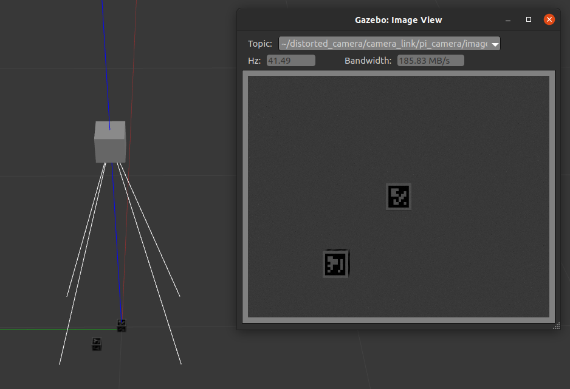
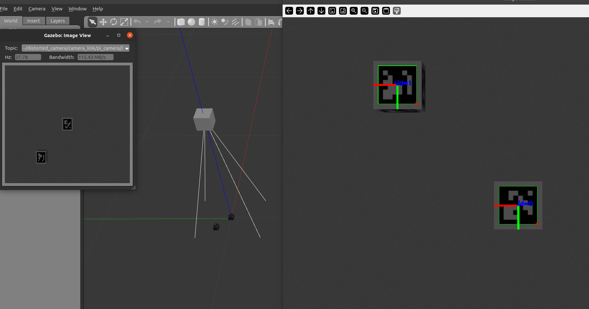
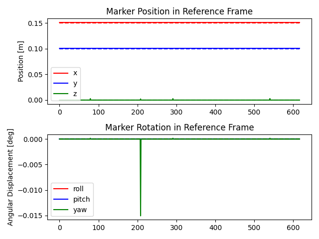
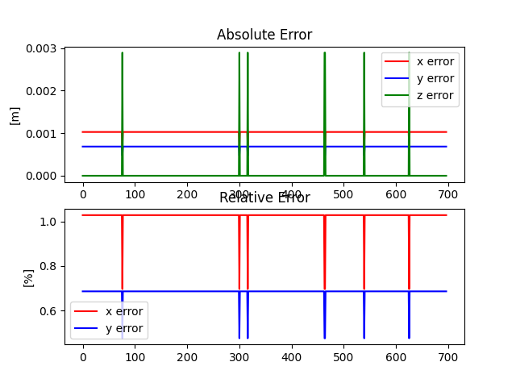

# Capstone

## Dependencies

Ubuntu 20.04+  \
ROS Noetic: http://wiki.ros.org/noetic/Installation/Ubuntu  \
catkin_tools: https://catkin-tools.readthedocs.io/en/latest/installing.html#installing-on-ubuntu-with-apt-get

## Installation Steps

### Git clone capstone
```
# Using https
git clone https://github.com/andrewipstirling/capstone.git
# store path for later
tmp_path=$(pwd)
```

### Create catkin_ws
```
mkdir capstone_ws
cd capstone_ws
mkdir src
catkin init
ln -s $tmp_var/capstone/ros_aruco_gazebo src
```

## Running Simulation (1 Camera + 1 Tag)
```
catkin build
# re-source ws
source devel/setup.bash
roslaunch ros_aruco_gazebo gazebo_sim.launch
```
### Using *ros_aruco_gazebo*

After launching, following topics are available:
- /pi_camera/camera_info
- /pi_camera/image_raw
- /pi_camera/image_raw/compressed
- /pi_camera/image_raw/compressed/parameter_descriptions
- /pi_camera/image_raw/compressed/parameter_updates
- /pi_camera/image_raw/compressedDepth
- /pi_camera/image_raw/compressedDepth/parameter_descriptions
- /pi_camera/image_raw/compressedDepth/parameter_updates
- /pi_camera/image_raw/theora
- /pi_camera/image_raw/theora/parameter_descriptions
- /pi_camera/image_raw/theora/parameter_updates
- /pi_camera/parameter_descriptions
- /pi_camera/parameter_updates

To start tracking, open second terminal, re-source workspace and run
```
rosrun data_fusion_py image_sub.py
```
### Preliminary Results

View of Simulation


View of Tracking


Plots

